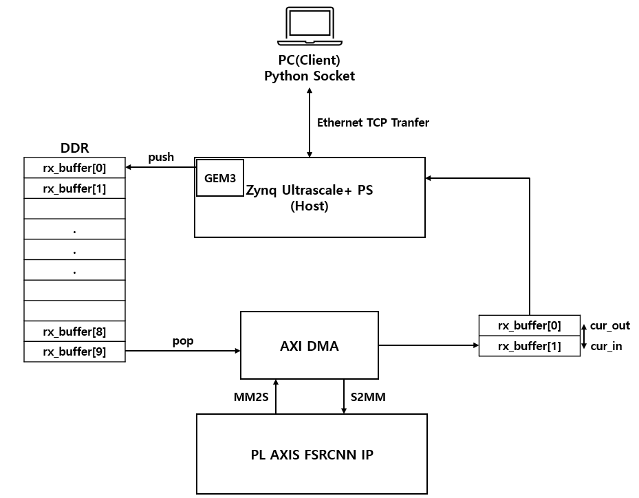

# Ethernet TCP Verification for AXI4-Stream Image Processing IP

## 1) Overview
This repository provides a **verification environment that integrates AXI4-Stream–based image processing IP with Ethernet TCP on FPGA**, and a **Python pixel-wise validation pipeline**.  
The primary goal is to **send frames from a PC to the FPGA over TCP, run them through AXI DMA ↔ AXI4-Stream IP, bring results back over TCP, and verify outputs at the pixel level in Python**.

**Status by version**
- **V1 – Header → DDR → TCP (2-frame test)**  
- **V2 – TCP RX → DDR → TCP TX (loopback)**
- **V3 – TCP RX → DDR → (optional DMA→AXIS IP→DDR) → TCP TX (7,220 frames)**

---

## 2) Repository Structure
```
Ethernet_TCP_Verification/
│── v1_Header_Test_workspace /
│ ├── src  # for vitis application project
│ ├── scripts  # python scripts
│ └── ...
│── v2_LoopBack_workspace /
│ ├── src
│ └── scripts
└── scriptsv3_Video_Streaming_workspace /
  ├── src
  ├── scripts
  └── ...

```

---

## 3) System Architecture
- **PC (Client)**: Sends raw frames (`.bin/.raw`) via TCP and receives processed frames; runs **pixel-wise validators**.  
- **FPGA – PS (MPSoC/Zynq)**: lwIP RAW TCP server for RX/TX; manages **DDR buffers** and **AXI DMA**.  
- **FPGA – PL**: **AXI4-Stream image IP** (e.g., FSRCNN layer, color converter, *Bicubic*).  
- **Dataflow**: `PC → TCP → PS(DDR) → DMA(MM2S) → AXIS IP → DMA(S2MM) → PS(DDR) → TCP → PC`

📌 `docs/ethernet_system_architecture.png`  


---

### DDR Buffering Strategy

- **Input Ring Buffer (10 slots)**:  
  Incoming frames are stored in 10 rotating DDR buffers.  
  Once a frame is fully received, it is marked as ready for processing.  

- **Processing**:  
  When the PL is idle, the next ready input buffer is **peeked**.  
  The frame is transferred to the PL using AXI DMA (MM2S), and the result is stored back into DDR using AXI DMA (S2MM).  
  After processing, the input buffer is **popped** and marked as available again.

- **Output Buffer (2 slots)**:  
  Processed frames are stored in one of two output buffers.  
  A circular index (`cur_out`) is used to alternate between them.  
  Once the frame is ready and cache-invalidated, it is transmitted back to the PC over TCP.

---

### Input/Output Example

### 📥 Input Frame (Low-resolution BGR24)
- Resolution: `320x180`, 3 bytes/pixel  
📁 `docs/dog_lr_x4.bmp`  


### 📤 Output Frame (Upscaled ABGR32 via Bicubic IP)
- Resolution: `1280x720`, 4 bytes/pixel  
📁 `docs/bicubic_output_frame1_opague.png`  

- **Note**: To sanity-check AXI4-Stream formatting in the full loop, we additionally exercised a teammate’s **Bicubic IP** in a controlled path. See **[Bicubic IP (GitHub)][[bicubic_ip](https://github.com/youngyang00/axi4s-bicubic-upscaler)]**.

---

## 4) Versions

### V1 — Header-Based Transmission (2 frames) — ✅ Completed
- **Flow**: `.h` (pre-loaded) → DDR → TCP → PC  
- **Goal**: Verify **TX path**, DDR→TCP send pipeline, and cache/flush discipline.  


### V2 — Ethernet Loopback via DDR — 🚧 In Progress
- **Flow**: `TCP RX → DDR → TCP TX → PC`
- **Behavior**: Each frame received from the PC is stored in a 10-slot ring buffer, then immediately sent back using a 2-slot TX buffer. No AXI4-Stream IP is involved.
- **Client**: Half-duplex (send one frame → receive one frame)
- **Goal**: Verify DDR buffering, flush/invalidate handling, and TCP TX/RX path without PL involvement.


### V3 — Long Video Streaming (7,220 frames) — 🚧 In Progress
- **Flow**: `TCP RX → DDR → (DMA → AXIS IP → DMA) → DDR → TCP TX → PC`
- **Behavior**: Frames are continuously streamed into DDR, optionally processed by AXI4-Stream IP, and sent back. Input uses a 10-slot ring buffer; output uses 2-slot TX buffer.
- **Client**: Full-duplex multithreaded (parallel send/receive)
- **Goal**: Stress-test full pipeline under sustained load and validate pixel-accurate output from the IP.

---

## 5) Build & Run

### Hardware (Vivado)
- Block Design: PS (DDR) ↔ **AXI DMA (MM2S/S2MM)** ↔ **AXI4-Stream IP**  
- AXI4-Stream interconnect clock example: **300 MHz**  
- Export **XSA** → Vitis

### Software (Vitis)
- BSP: **Standalone + lwIP RAW + AXI DMA driver**  
- Import `src/` (and `include/` if present), build **Release**, program board (bit + ELF)

### Python Client
```
# V1: 2-frame header test
python scripts/ethernet.py

# V2: Loopback test
python scripts/ethernet_frame_by_frame.py

# V3: Long video streaming
python scripts/ethernet_video.py
# Defaults: IP=192.168.1.20, port=6001, chunk=1460, fps=60
